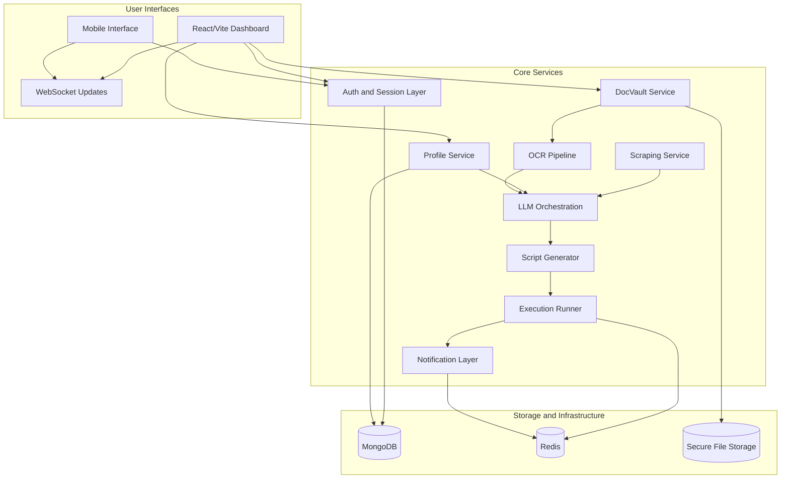

<div align="center">
  
  <h1>CivicFlow</h1>
  <p><strong>Private AI-Assisted Form Automation</strong></p>
  <p><em>Built by <strong>Team Tensors</strong> for the <strong>Faraway Hackathon 2026</strong></em></p>
</div>
# CivicFlow

**Private AI-Assisted Form Automation**  
Built by **Team Tensors** 
**Faraway Hackathon 2026**


***

## Table of Contents

- [Overview](#overview)
- [Problem Statement](#problem-statement)
- [Pain Points](#pain-points)
- [Our Solution](#our-solution)
- [What Makes CivicFlow Different](#what-makes-civicflow-different)
- [Key Features](#key-features)
- [User Journey](#user-journey)
- [System Workflow](#system-workflow)
- [Architecture Overview](#architecture-overview)
- [Core Services](#core-services)
- [Technology Stack](#technology-stack)
- [Why Each Technology Is Used](#why-each-technology-is-used)
- [Data and Execution Flow](#data-and-execution-flow)
- [Privacy and Security Approach](#privacy-and-security-approach)
- [Current Scope](#current-scope)
- [Future Roadmap](#future-roadmap)
- [Repository Structure](#repository-structure)
- [Getting Started](#getting-started)
- [Environment Variables](#environment-variables)
- [Running the Project](#running-the-project)
- [Demo Walkthrough](#demo-walkthrough)
- [Use Cases](#use-cases)
- [Challenges Addressed](#challenges-addressed)
- [Project Impact](#project-impact)
- [Team](#team)

***

## Overview

Government, education, recruitment, and institutional portals often require users to repeatedly enter the same personal information and upload the same supporting documents across multiple workflows. These processes are time-consuming, error-prone, and frustrating, especially for users who are not comfortable with long digital forms.

**CivicFlow** is a privacy-first, AI-assisted form automation platform that acts as a personal digital application assistant. It allows a user to create a reusable profile, store important documents in a secure vault, extract structured data from those documents, analyze target web forms, map the right values to the right fields, and automate the submission with human-in-the-loop intervention for OTPs, CAPTCHAs, and sensitive review steps.

The goal of CivicFlow is not just to auto-fill forms, but to create a trusted user-controlled application layer for repetitive digital workflows.

***

## Problem Statement

Digital public-service and institutional systems are often fragmented. Every portal asks for the same core information, but users still need to manually enter it each time. In addition, users must repeatedly search for the correct files, verify uploaded documents, and handle unclear requirements without guidance.

This creates a major usability and accessibility problem:
- repetitive data entry wastes time,
- manual uploads increase mistakes,
- users do not always understand what each field requires,
- sensitive document handling is scattered and inconsistent,
- interruptions like OTPs and CAPTCHAs break the user flow,
- non-technical users struggle with complex form journeys.

CivicFlow addresses this by converting profile data and documents into reusable structured intelligence that can be applied across many form-based systems.

***

## Pain Points

### Repetitive Work
A user applying for multiple services may type the same name, date of birth, address, phone number, educational details, and identity numbers again and again.

### Repeated Document Uploads
The same Aadhaar, PAN, passport, resume, income certificate, caste certificate, or academic proof is uploaded across multiple websites, often from different folders and formats.

### High Error Rates
Typos, mismatched fields, wrong uploads, and missed required fields lead to rejected submissions or delays.

### Confusing Portals
Many forms are not user-friendly. Labels may be inconsistent, steps may be unclear, and upload requirements may not be obvious.

### Sensitive Data Exposure
Users are forced to repeatedly share raw personal data and documents across many different systems.

### Broken Automation Reality
Traditional automation often fails when it encounters OTPs, CAPTCHAs, dynamic layouts, hidden fields, or anti-paste restrictions.

### No Unified Personal Workflow Layer
Users have documents, profile details, and application requirements, but there is usually no unified assistant that connects them intelligently and securely.

***

## Our Solution

CivicFlow provides a reusable, privacy-aware automation flow:

1. The user creates a structured profile once.
2. The user uploads important documents into a document vault.
3. OCR and parsing extract structured data from those documents.
4. CivicFlow analyzes the target form and identifies fields.
5. An AI mapping layer matches form fields with profile and document data.
6. The user reviews all suggested values and file choices.
7. A Playwright-based executor fills and navigates the form automatically.
8. If a CAPTCHA or OTP appears, the system pauses, asks the user for help, and resumes safely.

This creates a system where data is prepared once and reused many times.

***

## What Makes CivicFlow Different

### Privacy-First by Design
CivicFlow is designed around user control and data minimization, not just convenience.

### Human-in-the-Loop Automation
The system automates repetitive work but still lets the user intervene at important trust boundaries.

### AI-Assisted Form Understanding
Instead of using rigid static mappings, CivicFlow uses an intelligent mapping layer to understand messy field labels and form structures.

### Reusable Document Intelligence
Documents are not treated as passive files. CivicFlow extracts and organizes information so documents become reusable structured assets.

### Future-Ready Trust Architecture
The long-term vision includes SSO, verifiable credentials, selective disclosure, and blockchain-backed trust proofs without putting raw documents on-chain.

***

## Key Features

### 1. Reusable User Profile
- Store user identity and personal details in a structured way.
- Reuse the same profile across multiple form submissions.
- Support CRUD operations for profile maintenance.

### 2. Secure Document Vault
- Upload and manage supporting documents in one place.
- Keep a reusable vault of documents for future submissions.
- Allow the system to suggest relevant saved documents when forms require uploads.

### 3. OCR and Document Parsing
- Convert PDFs or images into extracted structured text.
- Identify useful fields such as names, numbers, dates, and addresses.
- Turn uploaded files into machine-usable data for mapping.

### 4. Smart Form Analysis
- Inspect target web forms dynamically.
- Identify fields, controls, labels, upload sections, and interaction patterns.
- Support multi-step workflows and real execution context.

### 5. LLM-Based Mapping and Planning
- Match target form fields with user profile and extracted document data.
- Improve field understanding beyond keyword-only logic.
- Reduce manual user effort during review.

### 6. Automation Execution Engine
- Generate Playwright-based browser automation logic.
- Fill fields, navigate steps, and support dynamic interactions.
- Track progress live through WebSockets.

### 7. Human Review and Intervention
- Let users review mapped values before submission.
- Pause for CAPTCHA, OTP, or manual confirmation.
- Resume execution after user response.

### 8. Real-Time User Feedback
- Show execution events on the dashboard.
- Keep users informed during long-running workflows.
- Support notification-driven intervention paths.

### 9. AI Counsellor Experience
- Guide users through complex requirements.
- Help them understand which documents may be relevant.
- Improve usability for complicated public or institutional forms.

***

## User Journey

A typical user journey looks like this:

1. The user signs in.
2. The user creates or updates their structured profile.
3. The user uploads important documents into the document vault.
4. CivicFlow extracts useful information from the uploaded documents.
5. The user selects or searches for a target form.
6. CivicFlow analyzes the target portal.
7. The AI layer maps profile and document data to the form.
8. The user reviews suggested fields and document choices.
9. CivicFlow starts browser automation.
10. If an OTP or CAPTCHA appears, the process pauses.
11. The user completes the required intervention.
12. CivicFlow resumes and finishes the submission.
13. The session history remains available for tracking and reuse.

***

## System Workflow

### Step 1: Profile Creation
The profile service stores structured reusable user data such as name, contact details, address, and other commonly required attributes.

### Step 2: Document Upload
The document vault accepts uploaded PDFs or images and stores them securely.

### Step 3: OCR Processing
The OCR pipeline processes those files and extracts useful structured information.

### Step 4: Form Discovery and Scraping
The scraping service reads the target page, detects available forms, identifies relevant elements, and prepares field metadata.

### Step 5: Intelligent Mapping
The LLM orchestration layer compares scraped fields with user profile and document data and produces suggested mappings.

### Step 6: Review Layer
The user confirms, edits, or completes missing information before execution begins.

### Step 7: Script Generation
The script generation layer creates Playwright-compatible automation logic tailored to the current form.

### Step 8: Execution
The execution runner launches the browser automation and fills the form step by step.

### Step 9: Pause and Resume
If OTP, CAPTCHA, or manual approval is needed, the execution pauses, the user is notified, and the flow resumes after confirmation.

### Step 10: Completion and Storage
The system stores session state, progress, results, and reusable insights for future workflows.

***

## Architecture Overview



***

## Core Services

### Profile Service
Handles user profile CRUD and maintains reusable structured identity data.

### DocVault Service
Accepts uploads, manages secure file handling, and links documents with extracted metadata.

### OCR Pipeline
Processes uploaded files, parses document content, and extracts structured text or attributes.

### Scraping Service
Inspects target pages, identifies forms, detects fields, and captures interaction metadata.

### LLM Orchestration Layer
Performs intelligent field mapping, planning, interpretation, and decision support.

### Script Generator
Creates execution-ready Playwright logic for the current form context.

### Execution Runner
Runs browser automation asynchronously and handles pause-resume flows.

### Notification Layer
Supports alerts and intervention signals for events such as CAPTCHA or OTP.

### WebSocket Channel
Streams progress, logs, and execution updates back to the frontend in real time.

***

## Technology Stack

### Frontend
- **React 18** for building the user interface.
- **Vite 5** for fast frontend development and builds.
- **React Router DOM** for SPA navigation.
- **Custom CSS Design System** for branding and UI consistency.

### Backend
- **Python 3.10+** as the primary backend language.
- **FastAPI** for APIs, orchestration, and async support.
- **Motor** as the async MongoDB driver.
- **WebSockets** for real-time session updates.

### AI and Document Layer
- **Google Gemini 2.0 Flash** for planning, mapping, and reasoning.
- **PaddleOCR** for extracting text from uploaded document images.
- **Poppler** for PDF-to-image processing where required.

### Automation Layer
- **Playwright** for browser automation and dynamic form execution.

### Infrastructure
- **MongoDB** for primary data storage.
- **Redis** for coordination, caching, and execution state handling.
- **Secure File Storage** for uploaded documents and artifacts.
- **Telegram integration** for user notifications and intervention prompts.

***

## Why Each Technology Is Used

### React + Vite
Used to provide a fast, modern dashboard where users can manage profiles, review mappings, and monitor execution progress.

### FastAPI
Chosen for its strong async capabilities, clear API design, and suitability for orchestration-heavy Python backends.

### MongoDB
Useful for flexible storage of profiles, sessions, extracted data, and evolving document metadata.

### Redis
Used for fast coordination of active sessions, pause-resume state, and runtime communication between workers.

### Playwright
Selected because form automation needs real browser interaction, dynamic DOM handling, and multi-step page navigation.

### Gemini
Used where field understanding, alias handling, planning, and intelligent matching are more useful than rigid rule-only systems.

### PaddleOCR + Poppler
Used to transform uploaded documents into text and field candidates that can be reused across workflows.

### WebSockets
Required for live progress updates because long-running executions must communicate status in real time.

### Telegram
Helpful as an out-of-band notification channel when user intervention is needed during automation.

***

## Data and Execution Flow

CivicFlow works with multiple data streams:

- **Profile data** stores reusable structured identity information.
- **Document data** stores uploaded file references and extracted values.
- **Form metadata** stores scraped field definitions and structure.
- **Execution data** stores run progress, events, and intervention state.
- **Session data** links users, forms, mappings, execution state, and results.

At runtime, profile data and document-derived data are merged into a suggested mapping layer. That mapping is then reviewed, transformed into automation logic, and executed in the browser.

***

## Privacy and Security Approach

CivicFlow is built around a privacy-first product direction.

### Current Principles
- Keep the user in control before final submission.
- Avoid unnecessary repeated exposure of sensitive data.
- Separate raw uploaded files from structured extracted metadata.
- Use controlled storage for documents and execution artifacts.
- Provide review before any critical automation step.

### Trust Boundaries
- AI suggests and maps, but the user confirms.
- Automation executes, but pause-resume events keep users involved when required.
- Sensitive uploads are handled through a dedicated document workflow.

### Long-Term Trust Direction
- SSO through OpenID Connect.
- Verifiable credentials for machine-verifiable claims.
- Selective disclosure of only required attributes.
- Blockchain-backed proof anchoring without storing raw documents on-chain.

***

## Current Scope

The current CivicFlow implementation focuses on:
- reusable user profiles,
- document upload and extraction,
- form scraping and field detection,
- mapping profile data to target forms,
- browser-based form execution,
- human-in-the-loop intervention flows,
- real-time execution visibility.

***

## Future Roadmap

### Phase 1: Stronger Automation Reliability
- Better script generation validation.
- Better retry handling and recovery.
- Improved support for more complex form patterns.

### Phase 2: Better Document Intelligence
- Smarter document categorization.
- Better file recommendation for upload-required fields.
- More robust structured extraction pipelines.

### Phase 3: Identity and Privacy Expansion
- OpenID Connect SSO integration.
- Better access control and trust-aware workflows.
- Selective disclosure-oriented design.

### Phase 4: Advanced Trust Layer
- Verifiable credentials.
- Blockchain-backed credential proof and status anchors.
- No raw documents on-chain.

***

## Repository Structure

```text
civicflow/
├── backend/
├── frontend/
│   └── react-app/
├── uploads/
├── assets/
├── scripts/
└── README.md
```

Adjust these paths if your repository structure differs.

***

## Getting Started

### Clone the repository

```bash
git clone https://github.com/team-tensors/civicflow.git
cd civicflow
```

### Backend setup

```bash
cd backend
pip install -r requirements.txt
playwright install chromium
```

Install Poppler as needed for PDF handling.

### Frontend setup

```bash
cd ../frontend/react-app
npm install
npm run dev
```

***

## Environment Variables

Create a `.env` file in the `backend/` directory.

Example configuration areas include:
- Gemini API key
- MongoDB URI
- Redis URL
- file storage configuration
- Telegram bot credentials
- JWT or auth secrets
- environment mode settings

If an example file already exists, copy it first:

```bash
cp backend/.env.example backend/.env
```

***

## Running the Project

### Run the backend

```bash
# Windows
python main.py

# macOS / Linux
uvicorn main:app --reload --port 8000
```

### Run the frontend

```bash
cd frontend/react-app
npm run dev
```

Open the frontend in the browser, usually at:

```text
http://localhost:5173
```

***

## Demo Walkthrough

1. Sign in or create an account.
2. Fill in the structured profile.
3. Upload sample documents to the document vault.
4. Let OCR extract document data.
5. Search for or open a target form.
6. Review detected fields and mapped values.
7. Confirm the execution.
8. Observe real-time progress updates.
9. If OTP or CAPTCHA appears, complete the intervention.
10. Resume and complete the automation flow.

***

## Use Cases

CivicFlow can be useful for:
- government application portals,
- scholarship and education forms,
- job application flows,
- institutional onboarding forms,
- repetitive administrative submission systems,
- any workflow where users repeatedly enter the same profile and upload the same files.

***

## Challenges Addressed

- Form inconsistency across websites.
- Repeated manual entry across applications.
- Repeated document uploads.
- Poor user experience in public-service portals.
- Difficult form labels and unclear requirements.
- Sensitive intervention points such as OTP and CAPTCHA.
- The gap between document storage and intelligent reuse.

***

## Project Impact

CivicFlow aims to improve digital accessibility and efficiency by reducing repetitive work and making form workflows more understandable and manageable.

The broader impact is not only speed, but also:
- fewer manual mistakes,
- lower user frustration,
- better completion support,
- stronger trust in digital workflows,
- a foundation for future privacy-preserving identity systems.

***

## Team

**Team Tensors**  
Faraway Hackathon 2026

Empowering citizens with secure, intelligent automation.
