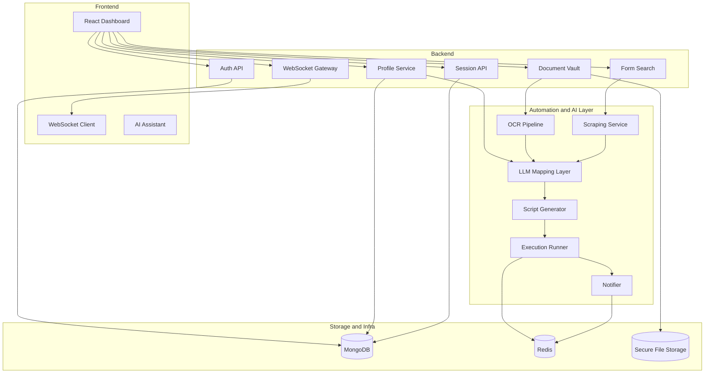

<div align="center">
  
  <h1>CivicFlow</h1>
  <p><strong>Private AI-Assisted Form Automation</strong></p>
  <p><em>Built by <strong>Team Tensors</strong> for the <strong>Faraway Hackathon 2026</strong></em></p>
</div>

***

## Overview

Government and institutional portals are often repetitive, time-consuming, and difficult to navigate. Users repeatedly enter the same information and upload the same documents across multiple services.

**CivicFlow** is a privacy-first, AI-assisted automation platform that helps users complete such workflows more efficiently. A user stores their core profile and documents once, CivicFlow analyzes the target form, maps the right data to the right fields, asks for final review, and then executes the submission with human-in-the-loop safeguards for OTPs, CAPTCHAs, and file checks.

## Vision

CivicFlow is designed as a personal digital application assistant.

The platform aims to:
- Reduce repetitive form filling.
- Reuse profile and document data across services.
- Keep the user in control during sensitive steps.
- Improve trust with privacy-first document handling.
- Evolve toward selective disclosure, verifiable credentials, and stronger identity flows.

## Key Features

### Privacy-First Document Vault
- Upload and manage identity or supporting documents in one place.
- Extract structured data from documents using OCR and document parsing.
- Reuse saved documents for future forms instead of uploading them repeatedly.

### Intelligent Form Automation
- Analyze real web forms and identify fields dynamically.
- Map profile and document data to target form inputs.
- Generate and run Playwright-based automation flows.
- Handle multi-step form execution with live progress updates.

### Human-in-the-Loop Controls
- Pause execution when OTP, CAPTCHA, or manual confirmation is required.
- Notify the user through the dashboard and resume after user input.
- Let the user review mapped values before final submission.

### AI Assistance
- Use LLM-powered reasoning for field mapping, planning, and form understanding.
- Support document suggestions and profile-to-form matching.
- Provide a guided assistant experience for complex workflows.

## Technology Stack

### Frontend
- React 18
- Vite 5
- React Router DOM
- Custom CSS design system

### Backend and Automation
- Python 3.10+
- FastAPI
- Playwright
- WebSockets
- Motor (async MongoDB driver)

### AI and Document Processing
- Google Gemini 2.0 Flash
- PaddleOCR
- Poppler
- Custom agent orchestration

### Infrastructure
- MongoDB
- Redis
- Secure file storage for uploaded documents and execution artifacts
- Telegram integration for notifications

## Architecture Overview



## Core Workflow

1. The user signs in and creates a reusable profile.
2. The user uploads documents to the document vault.
3. OCR and parsing extract structured information.
4. The user selects or opens a target form.
5. CivicFlow analyzes the form structure and fields.
6. The mapping layer matches profile and document data to those fields.
7. The user reviews suggested values and uploads.
8. CivicFlow generates an automation script and executes it.
9. If OTP or CAPTCHA is encountered, execution pauses and resumes after user input.
10. The session is stored for tracking, review, and future reuse.

## Repository Setup

```bash
git clone https://github.com/team-tensors/civicflow.git
cd civicflow
```

## Environment Setup

Create a `.env` file in the `backend/` directory:

```bash
cp backend/.env.example backend/.env
```

Update the environment variables with the required keys and service configuration, including the Gemini API key, database connection string, Redis configuration, and storage settings.

## Backend Setup

```bash
cd backend
pip install -r requirements.txt
playwright install chromium
```

Depending on the operating system, Poppler may also need to be installed for PDF processing.

### Run the backend

```bash
# Windows
python main.py

# macOS / Linux
uvicorn main:app --reload --port 8000
```

## Frontend Setup

```bash
cd ../frontend/react-app
npm install
npm run dev
```

Open `http://localhost:5173` in the browser.

## Demo Flow

1. Create an account or sign in.
2. Complete the user profile.
3. Upload sample documents to the document vault.
4. Search for or open a target form.
5. Review the mapped fields.
6. Confirm execution.
7. Solve OTP or CAPTCHA challenges if prompted.
8. Resume and complete the form flow.

## Privacy and Trust Direction

CivicFlow is being built with a privacy-first approach.

Current principles:
- Keep users in control of review and submission.
- Minimize unnecessary exposure of sensitive information.
- Separate structured metadata from raw uploaded files.
- Support secure storage and controlled access patterns.

Future direction:
- OpenID Connect based SSO.
- Verifiable credentials.
- Selective disclosure of only required user claims.
- Blockchain-backed trust proofs without storing raw documents on-chain.

## Team

**Team Tensors**  
Faraway Hackathon 2026

*Empowering citizens with secure, intelligent automation.*
